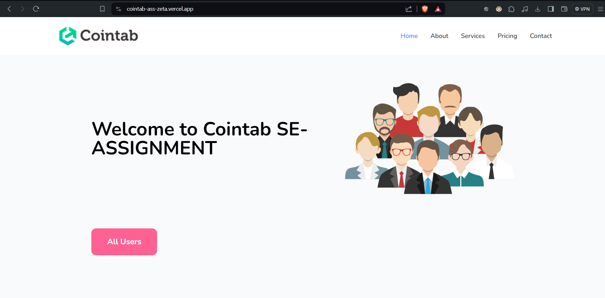
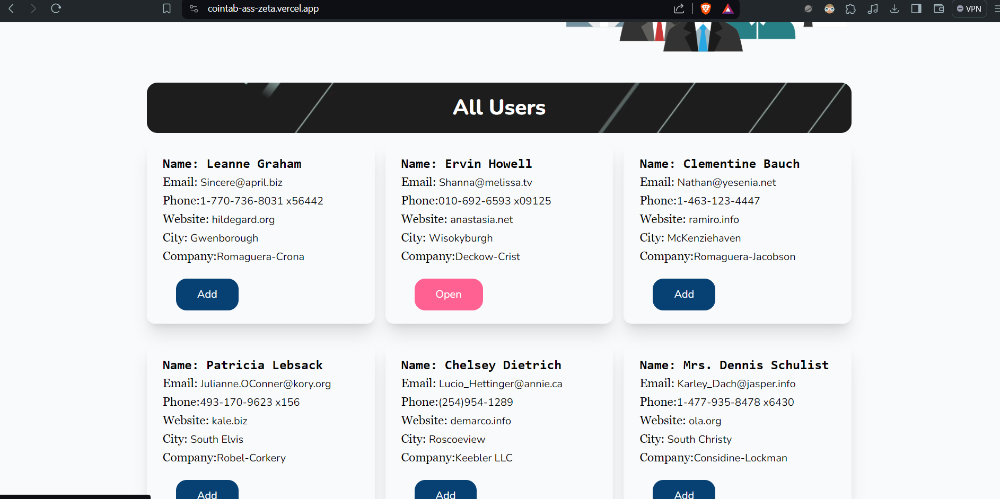
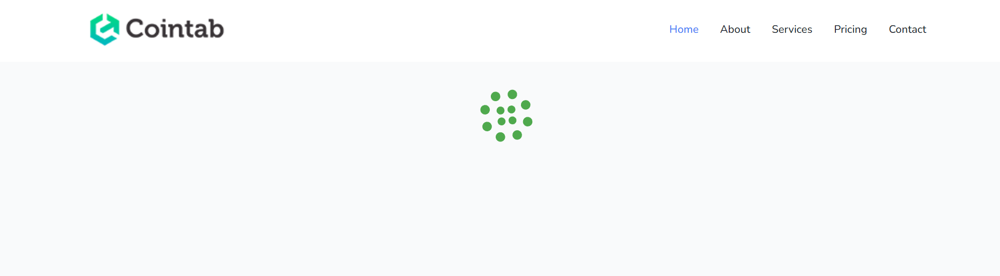
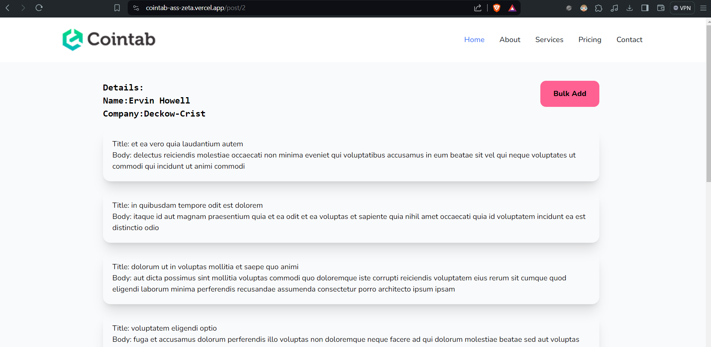
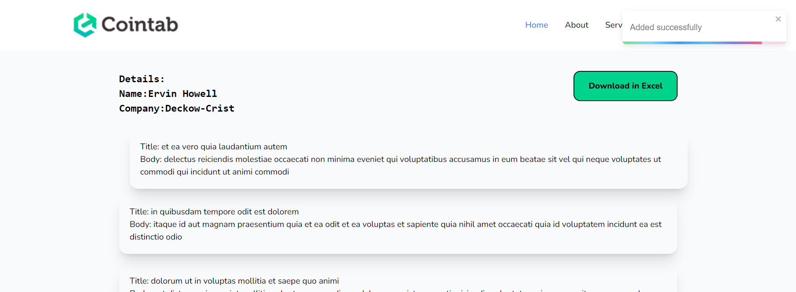

# Cointab SE-ASSIGNMENT

<h1 align="center">
🌐 MERN Stack App
</h1>
<p align="center">
MongoDB, Expressjs, React/Redux, Nodejs
</p>

<p align="center">
   <a href="https://github.com/amazingandyyy/mern/blob/master/LICENSE">
      
   </a>
   <a href="https://circleci.com/gh/amazingandyyy/mern">
      
   </a>
</p>

> MERN app,Tech Stacks-> MongoDB, Expressjs, React,NextJs, TailwindCss, Github, Nodejs.
# Cointab SE-ASSIGNMENT Full Stack Coding Assignment

---

This User based Website project represents a robust platform that integrates backend and frontend technologies to offer a seamless online user details experience. Leveraging Node.js for the backend, Next.js14 for the frontend, and MongoDB for the database, this application encompasses a comprehensive set of functionalities. managers.

---

## Requirements

- For development, you will only need Node.js and a node global package, NPM, installed in your environement.

## Clone or Download

```terminal
$ git clone https://github.com/tarun-upadhyay/Cointab_SE-assignment.git
$ yarn # or npm i
```

## Project structure

```terminal
** client
    - package.json
    - app
        - page.tsx
        - post/[id]/page.jsx
     - Components
     - Pages
         ---
** backend
    - package.json
    - app.js
    - controller
        - userController.js
        - allother controles..

 ```
 ## Client-side usage(PORT: 3000)

```terminal
$ cd client          // go to frontend folder
$ yarn # or npm i     // npm install packages
$ npm start          // run it locally
```

## Server-side usage(PORT: 5000 || 8080)

```
$ cd server          // go to client folder
$ yarn # or npm i    // npm install packages
$ npm start        // run it locally
```       

# Glimpses

## HomePage
  
  
  

## Post
 
 

 ---
# Thank you for your time 
-   Thank you for using this application
-   Feel free to ask any query.

[My Github](https://github.com/tarun-upadhyay)
https://github.com/tarun-upadhyay

[My Portfolio](https://tarun-upadhyay.github.io/)
https://tarun-upadhyay.github.io/

[Email ME](mailto:tarunu88@gmail.com)

---